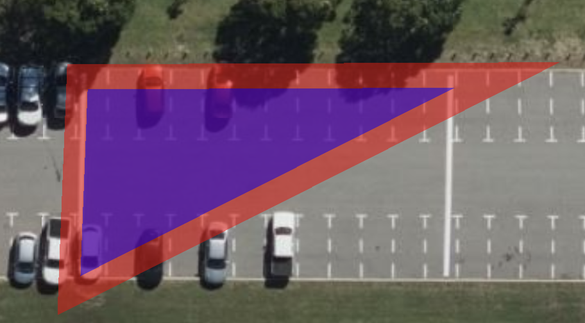
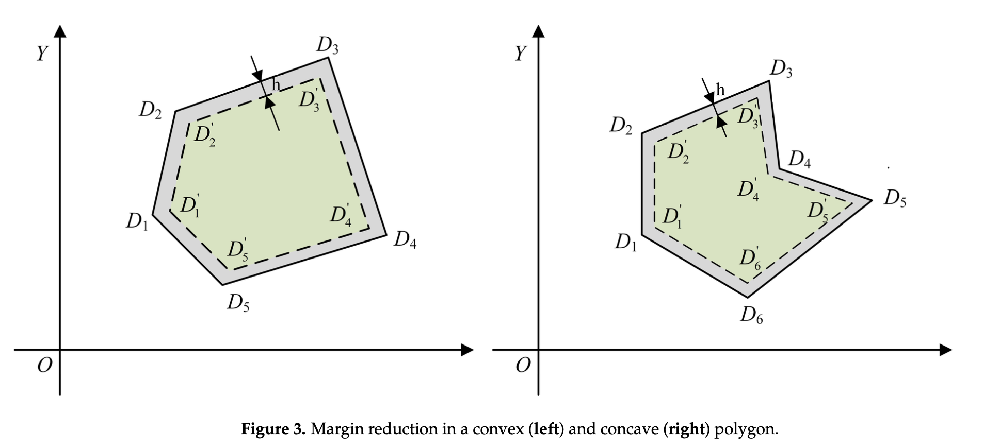

# Wayline Margin demo

This repository is a demonstration showcasing the creation of margins for flight routes. It utilizes CesiumJS and TurfJS libraries.

## Getting Started

```sh
$ npm i -g http-server
http-server
```

View on browser http://127.0.0.1:8080



## Solution


